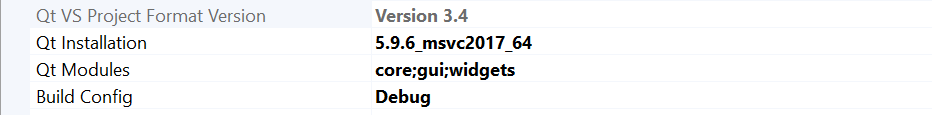
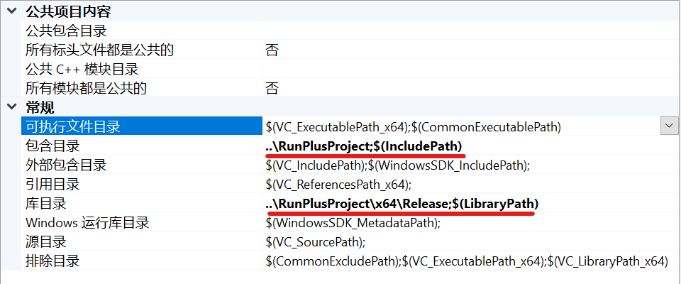
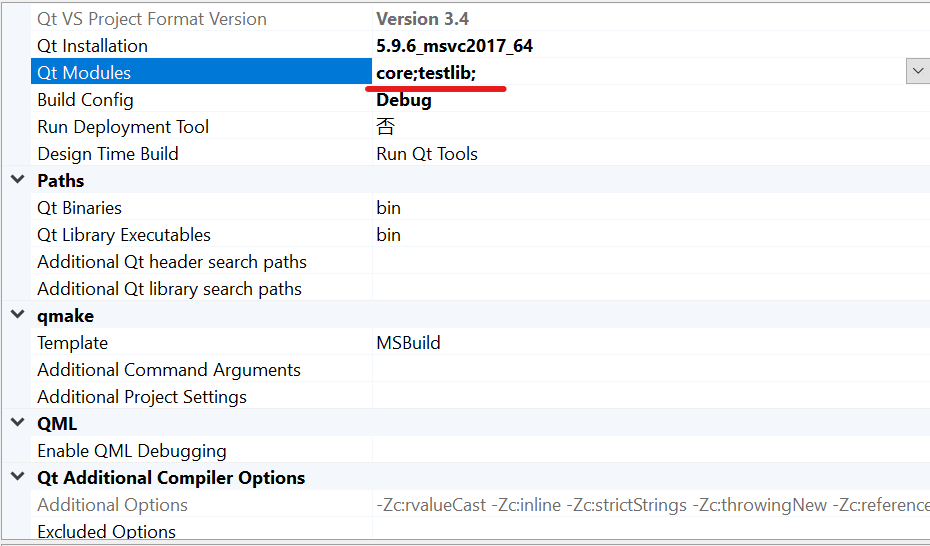
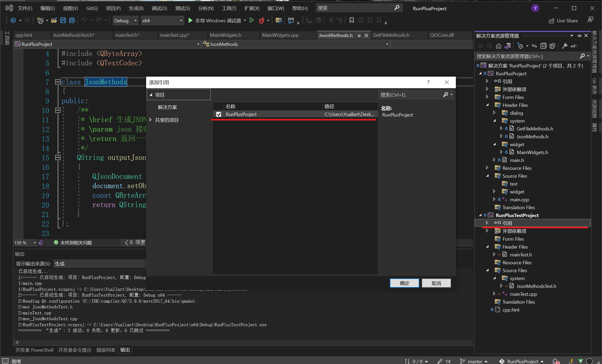

# RunPlus

> 作者：Yuallart

> 时间：2022-10-13

> 格言：不经一番寒彻骨，怎得梅花扑鼻香

### 应用篇

下载地址

RunPlus.zip -> 应用程序本体，解压即可运行				

 https://raw.githubusercontent.com/yuallart/RunPlusProject/master/x64/Download/RunPlus.zip

RunPlus.exe -> zip   自解压文件，采用文件虚拟化，仅在运行时解压，拥有更小的体积

https://raw.githubusercontent.com/yuallart/RunPlusProject/master/x64/Download/RunPlus-Pressed.exe

> 注意：所有下载版本均为x64版本，x32版本请自行下载项目编译

### 配置篇

#### RunPlusProject

- **项目所使用的配置**

  Debug和Release中的具体配置具体调整，尽量使用一样的配置进行开发

  - 编译器：Microsoft Visual Studio 2022
  - Windows SDK：10.0
  - 平台工具集：Visual Studio 2022 (v143)

> 配置不当也会导致项目报错，无法运行
- 项目所使用的模块

> Release中需配置链接器 -> 系统 -> 子系统 类型为窗口类型

---

#### RunPlusTestProject

- **配置所需包含的目录**

  在visual studio中是允许使用相对路径进行配置的，具体情况请具体处理

> 如没有正确配置以上的包含目录，会导致测试项目不可用

- 配置所需包含的QT模块

  如果没有特殊需求，可以不加入gui模块，使用控制台进行测试

> 缺少以上文件会导致编译器找不到所需库类

- **添加项目所需引用**

  非必须，但是建议加上此引用

> 缺少此引用有可能会导致测试项目无法运行

## Tips ->

**具体的各个项目的详细文档请查看具体根项目下的README.md文件**
